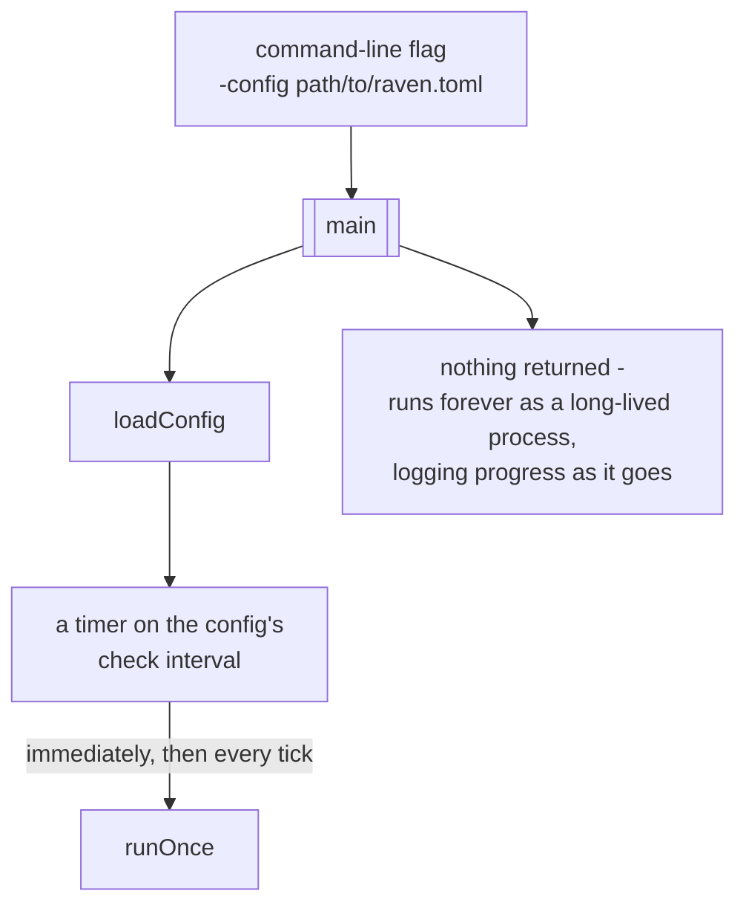
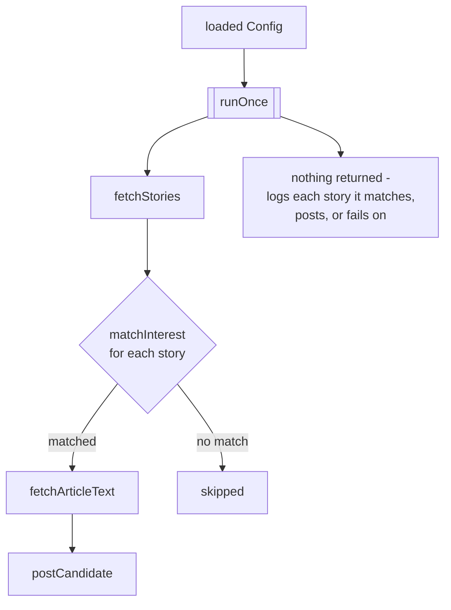
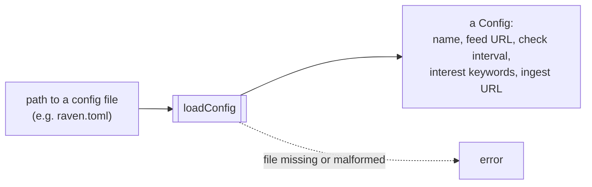
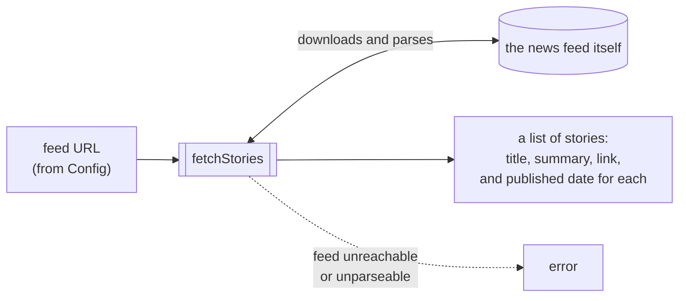
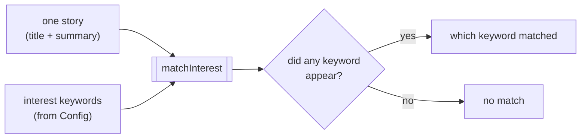
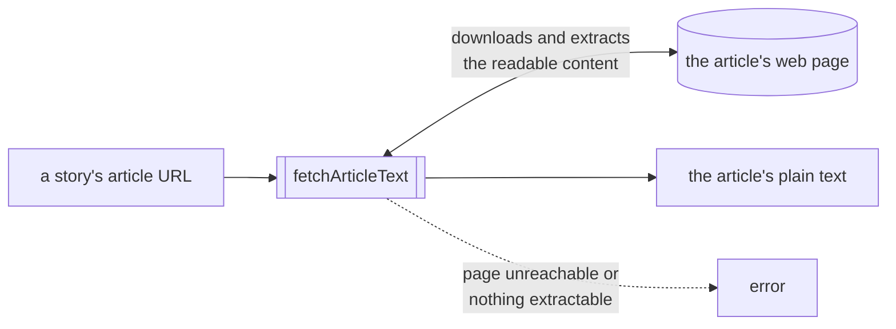
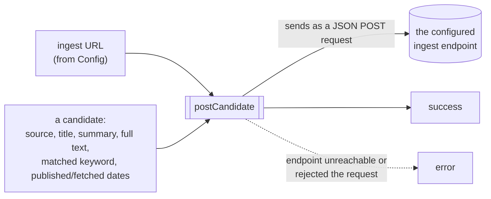

# Function diagrams

One diagram per function in this repo: what you need to give it, and what comes back out. Meant to
be readable without knowing Go - see [main.go](main.go) etc. for the actual implementation. Mirrored
on the Obsidian vault's root-level "Functional Diagrams" page.

## main

Entry point. Reads the `-config` flag, loads it, then checks the feed forever on the configured
interval - this is the process that keeps running once started.

## runOnce

One pass over the feed: fetch the headlines, and for every one that matches an interest, fetch the
full article and send it onward.

## loadConfig

Reads one Raven's TOML config file and turns it into the settings the rest of the program uses.

## fetchStories

Downloads and parses the configured news feed into a plain list of headlines.

## matchInterest

Checks one story's title/summary against the configured interest keywords.

## fetchArticleText

Fetches a matched story's full web page and strips it down to just the readable article text - no
ads, navigation, or other page clutter.

## postCandidate

Sends one matched, full-text story onward to Feather (or whatever ingest endpoint is configured) as
JSON.

